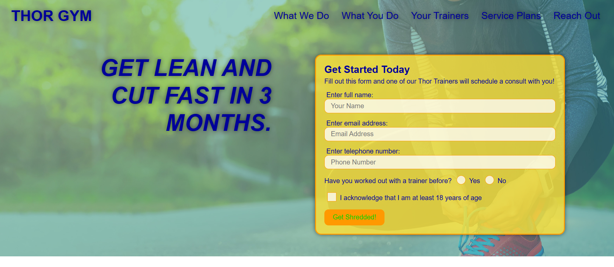

### THOR-GYM

________________________________________________________________________________________________________________________________________________________________
## Purpose
A responsive website that offers fitness training services.
____________________________________________________________________________________________________________________________________________________________________
 Project Visual :sunglasses:

___________________________________________________________________________________________________________________________________________________________________

____________________________________________________________________________________________________________________________________________________________________

## Website

https://maxkarltun.github.io/THOR-GYM/

## Contribution
Made with ❤️ by Max karltun

________________________________________________________________________________________________________________________________________________________

## Technologies In Practice :
  
  #### Front-end:
 

     
_______________________________________________________________________________________________________________________________________________________

# Work Completed
Building a website with HTML & CSS to fit a client mockup image. Work included:

- [x] HTML outlined, used semantic HTML
- [x] CSS added in hierarchical fashion, to meet design requiremetns
- [x] Form field added
- [x] Comments added in index.html and .css files for clarity around structure and function 
- [x] SEO + accessibility factors added: Meta Description, Meta Keywords, Title Tags, image alt text 

